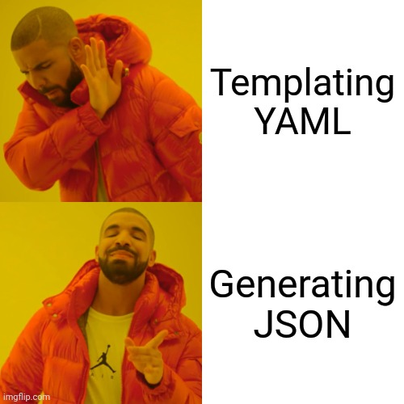

# Dotnet application deployment on AKS using Dhall

[](https://builtwithnix.org)

This repo contains a little proof of concept I am working on to easily deploy dotnet applications that would normally be hosted on Azure app service or using Azure function apps on Azure Kubernetes Service (AKS). This is mostly in the interest of being able to run them on non-Azure environments such as in a local cluster using Minikube or Rancher Desktop.

## Introduction

Most of this work is based on my previous project exploring [dotnet-aks-jsonnet](https://github.com/starcraft66/dotnet-aks-jsonnet). Due to the shortcomings of jsonnet (mostly due to its untyped nature), I decided to re-create this experiment in a competing configuration language, Dhall.
Most of this readme except for the following section is mostly identical to that of the aforementioned repo.

I am not nearly an expert in Dhall and everything in this repo was created in under 24 hours. I started out with zero knowledge of Dhall, having not written a single line of it in my life prior to undertaking this project. I spent roughly 3 hours reading the [Dhall manual](https://docs.dhall-lang.org/index.html) and got to work.

## Dhall vs Jsonnet

Having completed this exercise using both Jsonnet and Dhall, I can say with confidence that both these projects/languages have their shortcomings, however, I think that Dhall is more promising, as a developer.

Dhall: Dhall's biggest strength is that it is strongly typed and self-validating. Errors are straight to the point and it's essentially impossible to do something wrong and create an invalid manifest due to its type system and it creating bindings based on OpenAPI schemas. Unfortunately, it feels overly verbose to write and comes with annoyances like the lack of comprehensions for building lists from arrays. Maps are also missing from the language, though is is possible to output them in json/yaml documents using a feature in the compiler. It is also impossible to extend union types, making it frustrating to, for example, add a CRD to the union of kubernetes resources exported by the dhall kubernetes bindings. Other less critical annoyances include comments being overzealously removed by the formatter unless they are in very specific places due to them not being part of the AST.

Jsonnet: Jsonnet wins in terms of pure simplicity. It looks like json with functions, reads like json with functions and provides a quick and easy way to just write parametrized json without getting into the way too much. Unfortunately, simplicity comes at a cost. Its untyped nature means that anything that can produce valid json will happily be spit out by the compiler. Worse even, passing untyped state like maps and arrays or even nested versions of these around in the configurations makes refactoring very tedious and dangerous. Making simple changes can make the whole manifest generation blow up with hard-to-diagnose errors. I actually decided to rewrite everything in dhall when I wanted to keep working on the jsonnet version of this project and couldn't instantly decipher the code and the state being passed around in it when trying to make changes. Generating lists of objects based on arrays or maps was also made easy due to the language's support for list comprehensions.

## Keynote

I gave a keynote on this project at work and included the slides in this repo, they are in the `slides.pdf` file and they are in French.

---

## Goals:

1. First-class support for AKS-specificities like loading application secrets from Key Vaults
2. Ability to scaffold entire behemoths of kubernetes manifests while only requiring application-specific parameters from users.
3. Ability to set base and per-environment application setting overrides.
4. Support substituting AKS-specificities with local equivalents or mocks to make sure applications can always be run locally in an environment as identical as possible to the cloud
5. Be as DRY as possible.

## The approach:

I evaluated a few different solutions to the problem at hand including [Helm](https://helm.sh), [Kustomize](https://kustomize.io) and [Jsonnet](https://jsonnet.org).

Kustomize was the first solution I evaluated, mostly because I have a lot of experience with it, having used it extensively in my homelab and in production. It was an immediate non-starter for me because, as I learned from having used it a lot, its lack of "templating" leads to either the need to duplicate a lot of patches per-environment, making it the opposite of DRY, or to use an external program like `envsubst` to template over its output.

Helm is another solution I investigated, but I just can't stand its whole premise being templating YAML textually. I mean... [why the fuck are we templating YAML?](https://leebriggs.co.uk/blog/2019/02/07/why-are-we-templating-yaml) Is [this](https://github.com/bitnami/charts/blob/master/bitnami/redis/templates/master/application.yaml) really what we want to be writing and debugging all day when our templating engine, completely unaware of the semantics of the structures we are building, is templating whitespace-sensitive files? I could go on about this, but let's not get caught up.

There is, fortunately, a saner approach than templating to create configuration files... generating them! With a tool aware of the actual structures we are creating! Kubernetes uses YAML as its configuration format, which is a superset of JSON. This means we can use a purpose-built configuration DSL like Dhall to scaffold all of our deployment manifests and feed them directly into kubernetes as json or to optionally convert them to YAML before doing that.



Yeah, that's the approach I am taking in this project 😎

I am currently making extensive use of [this](https://github.com/dhall-lang/dhall-kubernetes) magnificent project that automatically generates Dhall bindings from the kubernetes api specification. Go take a look and star it, it is awesome!

## Roadmap:

- [x] Scaffolding configurations for `Deployment`, `Service` and `Ingress` from settings file
- [x] Support for AKS Key Vault CSI driver
- [x] Basic support for `dotnet-monitor` sidecar container
- [ ] Full support for `dotnet-monitor` sidecar container
- [ ] CRD support for `ServiceMonitor` etc.
- [ ] Environment-specific settings overrides
- [ ] Kubectl diff/Apply scripts

## Development instructions

1. Install [Nix](https://nixos.org/download.html) on your system and enable flake support.
2. If you have `direnv` installed and set up, run `direnv allow`. Otherwise, enter the `devShell` using `nix develop`.
3. Hack away!

## Runtime instructions

A sample run of the project's output is provided in the `output.yaml` file.

To generate it yourself, run:
```console
dhall-to-yaml --documents --explain <<< ./app.dhall > output.yaml
```
